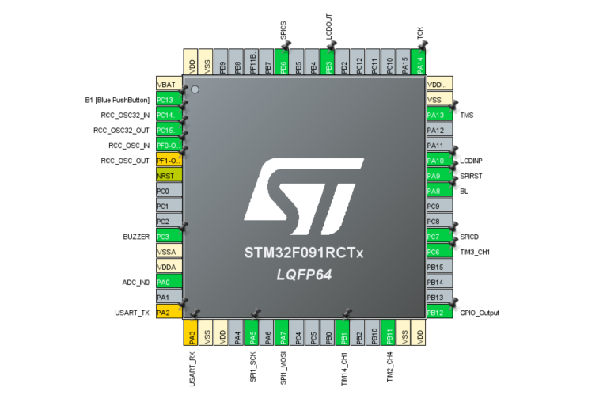
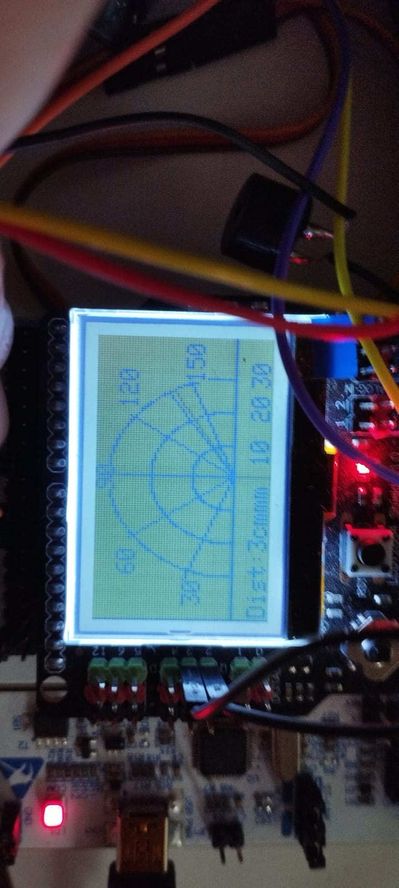

# STM32 Radar Object Detection
**Pins configuration**

## Project description

The following project had been done with the purpose of learning about various [embedded systems concepts](https://github.com/m3y54m/Embedded-Engineering-Roadmap), more exactly about microcontrollers, operating systems, sensors and actuators, interfaces.

The main concepts learned and applied in the project are:
- Working with hardware components (wiring, ports, understanding of diffrent components inside of a nucleo board, etc)
- What a microcontroller is
- GPIO
- Timers
- Clock management
- ADC
- DAC
- PWM
- SPI
- Interrupts
- Counters
- RTOS Basics
- FreeRTOS

The main purpose of the project is to have a radar that rotates to a max of 180 degrees in order to detect close object up to a range of 60cm and alerts the user about them through visual and acusting methods. Other in detail specs of the project are:

- The radar rotation is done automatically when first running the project but can also be done manually by using a joystick placed on the LCD Arduino Shield. The joystick have 5 directions from which one is used for toggling the rotation to auto back again, and 3 other for placing the radar at certain degrees covering all 180 degrees, by splitting the radar zones into 3 zones. 
- When the radar is toggled to manual position, if there is any object that is detected under 30cm, the buzzer will beep with an intensity based on how close the object is to the radar from 10 to 10cms.
- When running the project there will be an initial check if the LCD is connected to the board, if it is, the buzzer will beep 4 times.  

**Technical specs**:
- Radar rotates 180 degrees. The rotation mode is automatic by default, with a full cycle of rotation taking less than 30 seconds, and manual mode by toggling different joystick movements to cover 3 radar zones.
- A wire is connected to the digital pins of the LCD Shield in order to detect if the LCD is connected and is working. If the LCD is connected the buzzer will signal 4 times when running the project initially.

## Hardware components
- [Nucleo F09RC Developing Board](https://www.st.com/en/evaluation-tools/nucleo-f091rc.html)
- [SG90 Micro Servo](https://www.friendlywire.com/projects/ne555-servo-safe/SG90-datasheet.pdf)
- [Ultrasonic Module HC-SR04](https://cdn.sparkfun.com/datasheets/Sensors/Proximity/HCSR04.pdf)
- [LCD12864 Arduino Shield](https://wiki.dfrobot.com/LCD12864_Shield_SKU_DFR0287)
- [Buzzer](https://refcircuit.com/articles/23-simple-buzzer-library-for-stm32-hal.html)

## Project structure (software)

The following procedures were made in order to ensure a good quality of the code:
- Kept the methods under 50LOC 
- Documented and added comments for each module, functions and variable that wasn't self explanatory. Wrote about the why, not the how. 
- Split the code into modules by their purpose (buzzer, servomotor, ultrasonic, LCD). 
- Kept the code short, used the HAL Library, didn't reinvent the wheel, iterated fast.
- Tried to keep pins related to a certain feature as close as possible to each other in the IOC configuration 
- Added proper labels for pins, in order to easily identify them in the configurator  

## Useful resources

If you want to implement this project or a similar project, feel free to fork the repo, and consume the bellow resources for more concrete documentations and explanations. To interact with the author either create a issue on the project or [read my readme page from my github profile](https://github.com/DariusMuscalu), thanks.

The following *public* resources have been used for the studying material in order to create this project. Keep in mind they aren't place in a particular order.

- [A series of videos I researched on different topics related to embedded](https://www.youtube.com/watch?v=sqBGjR3MTEU&list=PL0mNqxspWgJndGjD3ojeeTYwqeEjoGVo9)
- [Nucleo-f091rc refference manual](https://www.st.com/resource/en/user_manual/um1724-stm32-nucleo64-boards-mb1136-stmicroelectronics.pdf)
- [Nucleo-f091rc documentation](https://www.st.com/en/evaluation-tools/nucleo-f091rc.html#documentation)
- [Mastering STM32 Microcontrollers Through Layered Learning](https://medium.com/@CTasdemir/mastering-stm32-microcontrollers-through-layered-learning-a3c22b76d1ec)
- [Servo Motor with Nucleo STM32F446RE using STM32CubeIDE](https://www.micropeta.com/video102)
- [Basic Electronics](https://www.instructables.com/Basic-Electronics/)
- [Simple buzzer library for STM32 HAL](https://refcircuit.com/articles/23-simple-buzzer-library-for-stm32-hal.html)